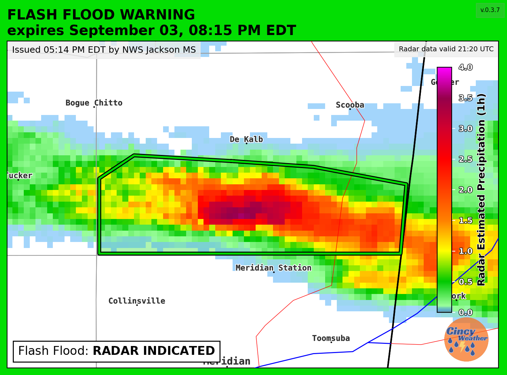
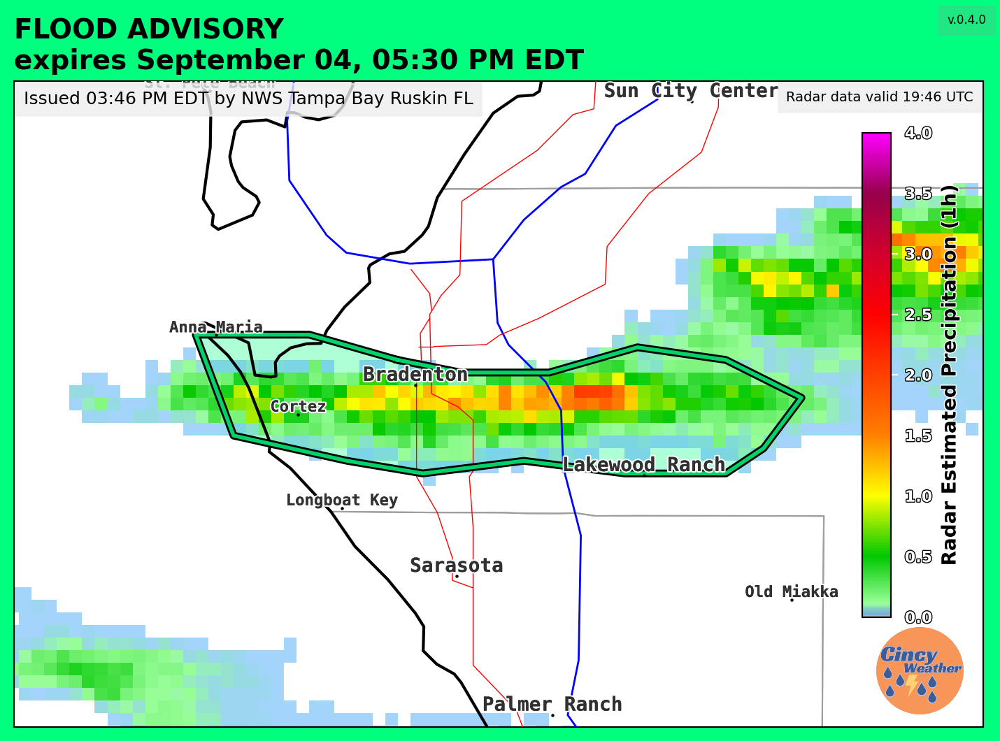
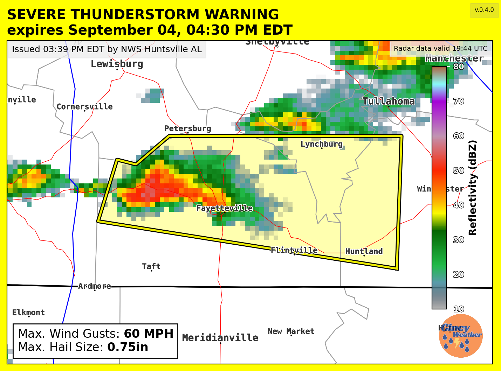
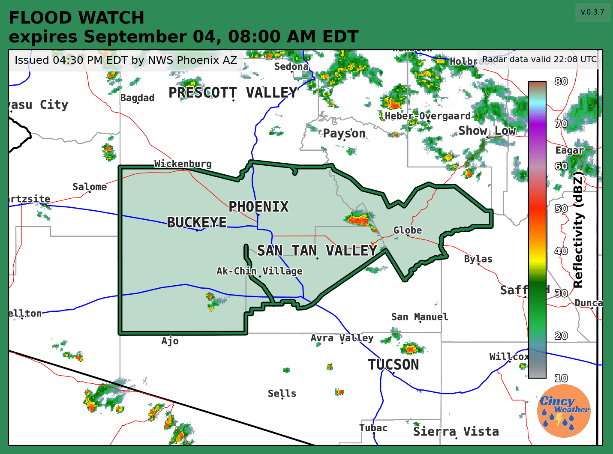

# warnings_on_fb 
*13,029 (and counting) alerts generated!*


---
## What it does:
1. Scrapes the publicly-facing [NWS alerts api](https://api.weather.gov/alerts/active) for chosen alerts in a chosen bounding box (see [supported alerts](#supported-alerts) and [areas](#supported-areas) for more info)
2. Generates a polygon from the alert geometry
3. Uses open-source GIS tools to add in US highways, interstates, county/state borders, and city names onto the selected map area. 
4. Polls the NCEP MRMS server (unless a recent cached scan is available) and downloads the latest reflectivity (default) or 1hr-QPE (FFW, FFA) data, and overlays that onto the map, for better context. 
5. After the graphic is generated, it can go to any number of end users. Currently supported are sending to a Facebook page and/or Discord server. Instagram posting is possible, but not available at-scale/for more than a metro-area or two worth of alerts. Also included in the download is the `slideshow.py` file, which uses `pygame` to create an auto-updating slideshow with all active alerts.

## Supported Alerts:
- Tornado Warning
- Severe Thunderstorm Warning
- Flash Flood Warning 
- Special Weather Statement (convective & non-convective)
- Flood Advisory
- Special Marine Warning
- Dust Storm Warning
- Frost Advisory
- Dense Fog Advisory
- Freeze Warning
- Tornado Watch
- Severe Thunderstorm Watch
- Flood Watch
- Flash Flood Watch
## Supported Areas:
- Complete support of CONUS
- Complete support of Alaska
    - Uses cities dataset w/ smaller cutoff for greater usability
- Near-complete support of Puerto Rico (no roads available to plot)
- Partial support of Hawaii
    - No known issues, but more testing is needed
- No support of Guam
    - No dataset for Guam cities
    - Issues with plotting MRMS data on Guam domain
## Tools Used:
```python
 metpy, matplotlib, shapely, cartopy, geopandas, datetime, time, timezonefinder,
 pytz, math, colorama, re, requests, gc, json, gzip, xarray, os, threading, 
 tempfile, discord_webhook, dotenv

```
## Contributions: 
Want to contribute? Great! Each main project `.py` file has a cluttered list of TODOs at the top, with general ideas for improvements and fixes. Some of these might be completed but not checked off, or not applicable any more. For a more structured list of needs, check out the [Issues](https://github.com/nickkessel/warnings_on_fb/issues) page on the repository. I'd say that the biggest needs right now are more testing of different types of alerts in unusual areas (and just general resiliency), improving the caption/details text, and adding more integrations (Instagram/Meta Business Suite being the biggest).
## License:
MIT License + Commons Clause *[more](LICENSE)*.
## Contact:
You can email me (nick) at [kesse1ni@cmich.edu](mailto:kesse1ni@cmich.edu), or DM me on [Twitter](https://www.x.com/wX_nvck).
## Examples:

 
 

  